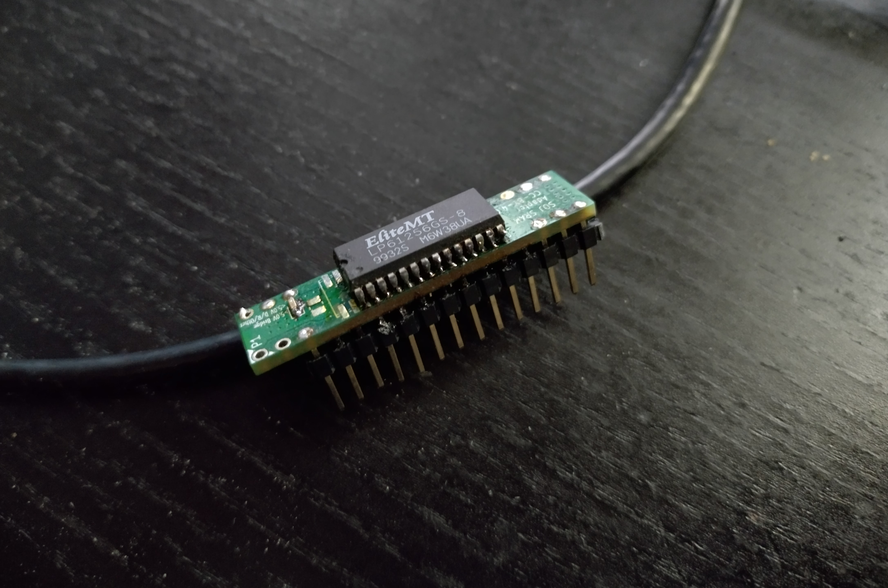

# SOJ32 <-> DIP32s adapter

These files contain an adapter allowing you to use a SOJ32 package SRAM chip on older 486 (and other) motherboards. Some others have been posted on vogons but I could not find any available schematics so I made another one inspired by some of those available on the forum.

This pcb is 4 layered, if you want the 2 layered version contact me. I also have a TSOP version but that one is not finished and untested.

# How to

Solder the SOJ32/28 chip by means available to you, if you do it like me it might get messy but it will work. 

* SOJ32: solder as is
* SOJ28: solder on the lower pins, optionally cut the top of the board off to make it fit

Noteworthy parts:

* CE and VDD are connected. All motherboards I have already do this and I have never seen one with a different variant, they all use OE to enable them. 
* The pads near pin 3 can be used for a 0603 diode to drop the voltage to allow 4.5v chips to be used since they have ~.5v tollerance on the input pins. YMMV since it will still be out of spec of the chips. Make sure you carefully select a diode as the voltage drop is dependant on current. Make sure to cut the strip connecting the pads if you intend to do this.
* The pads near the SOJ32 part can be used for an optional 0805 capacitor, value at your chosing.
* To connect the pins, cut the middle ones a bit short and solder everything together. It should hold up just fine especially if you use a strip of them. It is recommended to use the thinner pin-arrays but as you can see below I did not have those available and standard 2.54mm pins might work on your motherboard.

# How it looks

Note: wire to hold it on an angle is not included.

# License

This work is licensed under CC BY-NC 4.0 (https://creativecommons.org/licenses/by-nc/4.0/)
