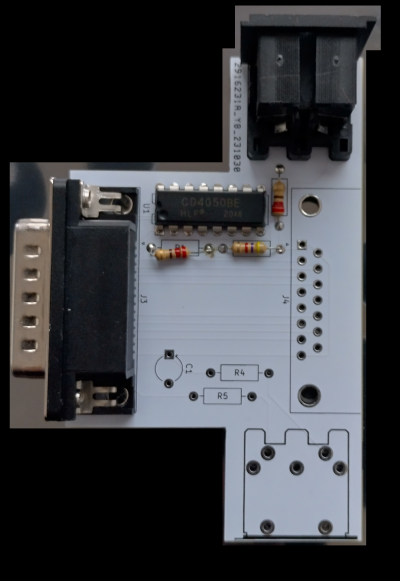

# Gameport to midi out adapter
Gameport to midi out adapter with gameport out. Since most adapters only export the midi port and do not pass though the gameport I decided to make one myself.
If you only care about the midi out, serdashop (https://www.serdashop.com/ I'm not affiliated) has one available.

Theoretically you can put as many midi out's on there as there are buffers, YMMV. This PCB was made so you can either cut the top or bottom midi port off. The reasoning for this is the different layout of ISA and PCI cards, which reverse the orientation of the port due to the PCB's being reversed.

Why throughole? It's easier to work with and it's what I had available.

Why no midi in? I'm not using it and also had no optocouplers available.

New version has rear facing ports and nets.

# Components
* 4050 buffer chip
* 4k7 resistor
* 220 resistor (2 per port)
* (Optional) a capacitor of your chosing. It is highly unlikely you need one.

# Additional instructions
You need to glue the shielding onto the connector, unless you can find one which has the shielding already molded in since you need to remove the screws on the male part.

# License

This work is licensed under CC BY-NC 4.0 (https://creativecommons.org/licenses/by-nc/4.0/)

# First attempt

This is my initial version. Not my best soldering work but it works. As you can see I made the mistake of aiming the port to the side, this does not work well. Also: I forgot the GND/VCC nets ...
