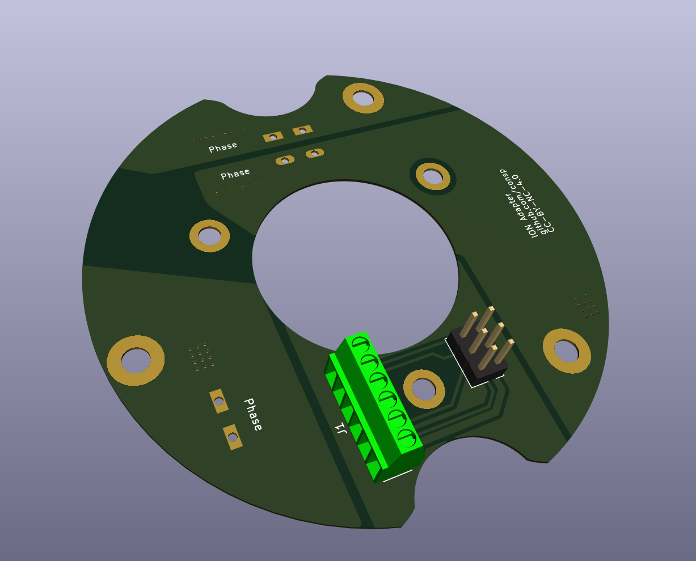
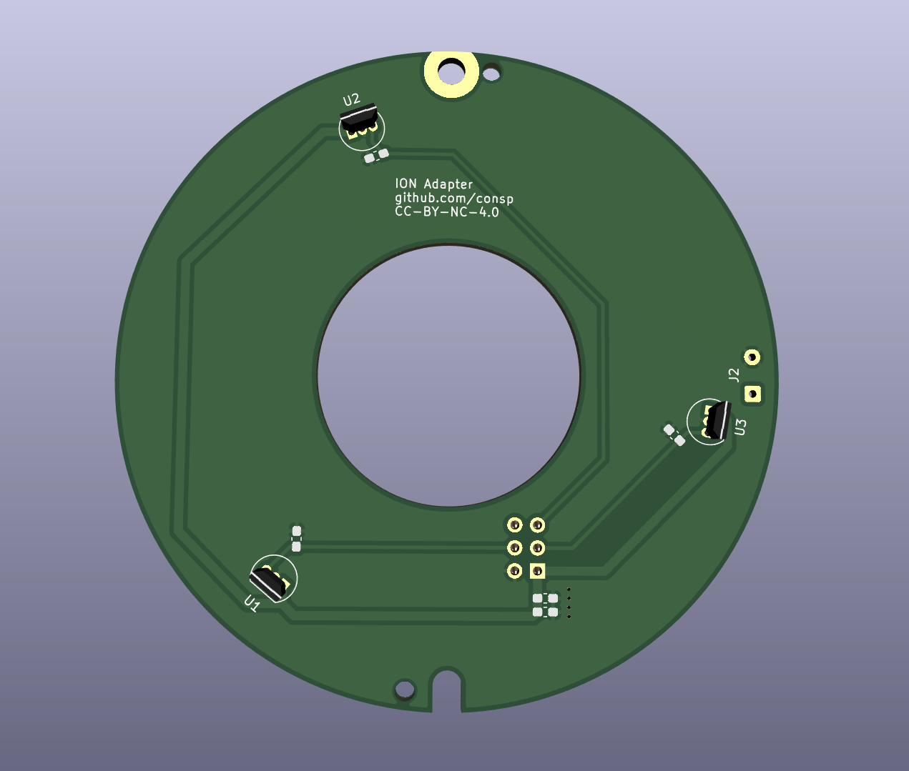

# Adapter for the (Sparta) ION XGT motors

The motor is a 20 pole, 24 slot PMSM. It should be able to function with hall sensors but due to how it's configured you need to make sure the hall sensors are very precicely aligned.
The top cover has a magnet ring which also has 20 magnet poles, we use that for hall sensors.

I forgot to take pictures before I sealed the motor again ... so no live images.

Features:
* WAGO 238-402 connector, which you can get from the original board
* Phoenix (or equivalen) 2.54mm screw terminals for the signal wires.
* Bottom and top traces for the phases since the cheap PCB manufacturers use 1oz copper you need as much as you can get, but it should be more than enough for the 24A max rating of the WAGO connectors.
* 0603 capacitor slots for when the s/n ratio is too much due to bad cable shielding, if you get a 15khz signal the phases are messing with the hall sensors. By putting a 1nF cap on all sensor lines you can get rid of some of the 15khz noise. Add caps to the power line if those cause troubles, this was not needed for my setup.
* (optional) Hall mounting bracket to get the sensors in the right place and keep them there, they need to be mounted max 9mm above the pcb. https://github.com/consp/cad/tree/main/sparta-ion-motor-hall

Advise to put together:

* Disassemble motor, and remove old PCBs
* Put new PCB in, make sure the contact is good with the phase screws. Middle screws can be ommitted, they are for tightening the fets to the heatsink but we do not need that but it's nice to have.
* Pull your favourite 8/9 strand wire though the bearing hole. If you remove the bearing from the coverplate and only install that, it is very easy to access.
* Put the phase leads into the connectors.
* Put the bearing in place, grease/seal the cable in place to avoid basic water ingress and put the bearing in the correct spot.
* Put on the cover plate and align the plate.
* Test the motor's functionality.
* It is possibley the hall phases are not exactly 60 degrees between transisions. You will need a motor controler which can handle that. They are consistent though.
* Seal the cover plate with anti-water sealant and tighten it.

# License

This work is licensed under CC BY-NC 4.0 (https://creativecommons.org/licenses/by-nc/4.0/)

# board

# Final version

