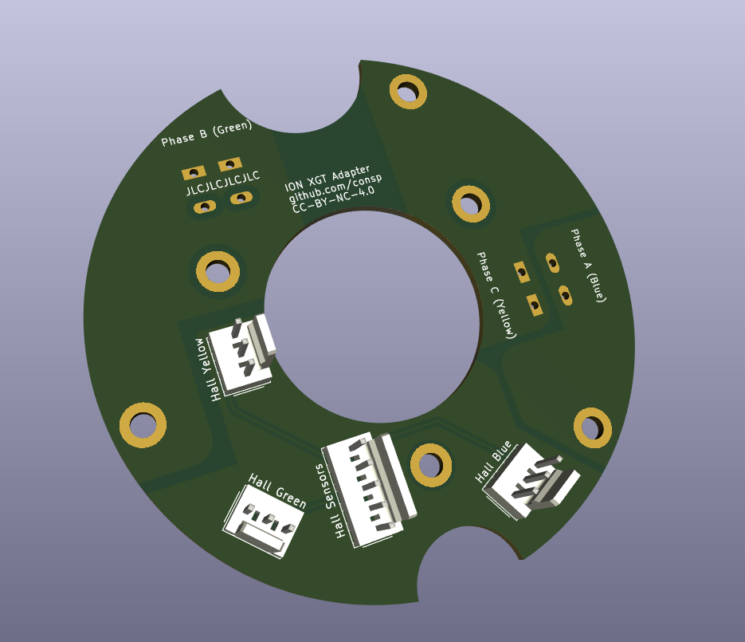

# Adapter for the (Sparta) ION XGT motors

The motor is a 10 pole (20 magnet) 24 slot PMSM. It should be able to function with hall sensors but due to how it's configured you need to make sure the hall sensors are very precicely aligned.
Since it's difficult to find the AA winding I just did the "put hall sensor on scope and measure line-to-line voltage" method to find the correct slot. The sensors should be placed 8 slots apart (so actually at 120 degrees). I Do not know if all motors are wound the same so ymmv with sensor placement.

-picture- (tbd, still working on it)

Why connectors? I think it's nicer and it allows me to change stuff easilly if I screw up (as in, mix up the poles/hall sensor positions ~again~).

Features:
* WAGO 238-402 connector, which you can get from the original board
* Standard 3/5 pin molex connectors, of course you can use any 2.54mm pinheader for the hall effect sensors
* Bottom and top traces for poles since the cheap PCB manufacturers use 1oz copper you need as much as you can get, but it should be more than enough for the 24A max rating of the WAGO connectors.

Advise to put together:

* Disassemble motor, and remove old PCBs
* Put new PCB in, make sure the contact is good with the polescrews. Middle screws can be ommitted, they are for tightening the fets to the heatsink but we do not need that.
* Pull your favourite 8/9 strand wire though the bearing hole. If you remove the bearing from the coverplate and only install that, it is very easy to access.
* Add the connectors (easiest is when you can still pull the wire though a lot)
* Mount the connectors to the board. Optionally glue them in, do that AFTER you tested everything.
* Put the pole leads into the connectors.
* Put the bearing in place, grease/seal the cable in place to avoid basic water ingress and put the bearing in the correct spot.
* Put on the cover plate and align the plate.
* Test the motor's functionality.
* (Mostly optional but likely) Do it all over again since the poles are misaligned and/or hall sensors are in the wrong spot.
* Seal the cover plate with anti-water sealant and tighten it.

# License

This work is licensed under CC BY-NC 4.0 (https://creativecommons.org/licenses/by-nc/4.0/)

# board

# First attempt
